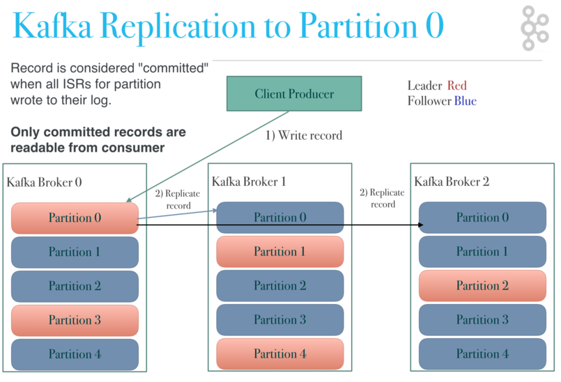
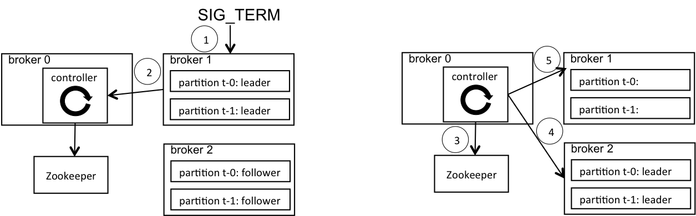

# Kafka

Kafka通常用于两大类应用：

- 在系统或者应用之间建立实时可靠的获取数据的数据流管道；
- 构建转换或相应数据流的实时流应用程序。

几个概念：

- Kafka作为一个集群运行在一个或多个可跨多个数据中心的服务器上；
- Kafka集群以主题的类别存储记录流；
- 每条记录都包含一个键，一个值和一个时间戳。

## Topics and Logs

主题是发布记录的类别或订阅源名称。Kafka的主题总是多用户；也就是说，一个主题可以有零个，一个或者多个消费者订阅写入它的数据。

对于每个主题，Kafka集群都维护一个分区日志：

每个分区都是一个有序的，不可变的记录序列，不断附加到结构化的提交日志中。分区中的记录每个都分配了一个成为偏移的顺序ID号，它唯一地标识分区中的每个记录。

在可配置的保留策略过期前，Kafka集群持久化所有的记录，不管是否被消费。

每个消费者保留的唯一元数据是该消费者在日志中的偏移或者位置，这种偏移由消费者控制。

日志中的分区有多种用途。首先它们允许日志扩展到超出适合单个服务器的大小。每个单独的分区必须适合托管它的服务器（的存储空间），但主题可能有许多分区，因此它可以处理任意数量的数据。其次，它们充当了并行性的单位。

## Partition

在Kafka中，一个topic 可以有多个分区，记录在这些分区中分发。分区是并发的基本单元，通常越多的分区意味着更高的吞吐量。

日志的分区分布在Kafka集群中的服务器上，每个服务器处理数据并请求分区的共享。每个分区都在可配置数量的服务器上进行复制，以实现容错。

每个分区都有一个服务器充当“领导者”（leader），零个或者多个服务器充当“追随者”（follower）。领导者处理分区的所有读取和写入请求，而追随者被动地复制领导者。如果领导者是失败，其中一个追随者将自动成为新的领导者。每个服务器都充当某些分区的领导者和其他分区的追随者，因此集群可以达到负债均衡。

# 

[Kafka分区副本](http://cloudurable.com/blog/kafka-architecture-topics/index.html)

### Kafka 分区领导者管理

Kafka集群中的一个代理（broker）充当管理整个集群的控制器（controller）。如果一个代理失败了，如果该代理充当分区的领导者，控制器负责为失败的代理上的分区重新选举新的领导者。

默认情况下，Kafka 代理会进行`受控关闭(controlled shutdown)`，以最大限度地减少对客户端的服务中断。受控关闭通过几个步骤进行：

1. SIG_TERM 信号被发送给即将关闭的代理；
2. 代理给控制器发送请求表示自己即将关闭；
3. 控制器将分区领导者角色从该代理改成其他的代理并持久化到ZooKeeper；
4. 控制器发送新的分区领导者给其他的代理；
5. 控制器发送成功回应给即将关闭的代理，代理最后关闭其进程。

[Kafka分区leader管理](https://blogs.apache.org/kafka/entry/apache-kafka-supports-more-partitions)

如果控制器发送故障，Kafka集群会自动选举另一个代理作为新的控制器。在能够选择分区领导者之前，新选出的控制器必须首先从ZooKeeper重新加载集群中的所有分区的状态。如果控制器出现硬故障，则分区不可用的窗口可以与ZooKeeper会话到期时间加上控制器状态重新加载时间一样长。因此，减少状态重新加载的时间可以提高这种罕见事件的可用性。

## Producers

生产者发布数据到它们选择的主题。生产者负责在主题中选择一个分区分配记录。

## Consumers

消费者给自己打上消费者组名（consumer group name）标签，发布到主题的每条记录被传递给订阅该主题的消费者组中的一个消费者。消费者实例可以存在于隔离的进程或者机器。

给消费者指定消费者组时，注意不同业务应分不同消费者组，否则某些业务可能消费不到分区中的数据。

